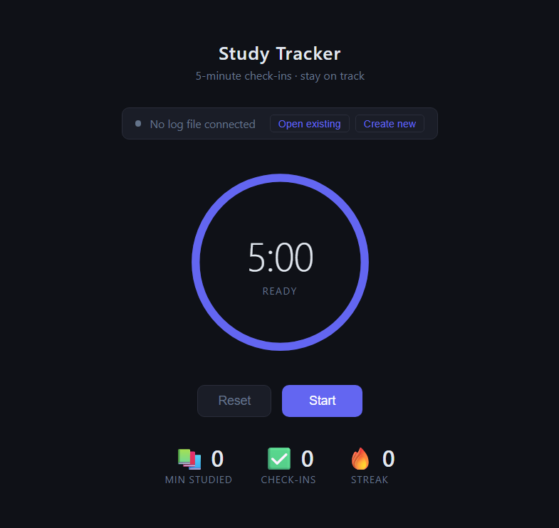

# Minimalist-Time-Tracker

A self-contained browser app for tracking focused work sessions with 5-minute check-ins. No backend, no dependencies — single HTML file.

### Preview

### Features

- Circular countdown timer with color-coded urgency (blue → amber → red)
- Pre-session gate: a checklist (eaten · water · phone away · tabs closed) plus a planned length (25/50/90 min) before each session
- Max session length with auto-end: at the planned length a bell offers End / +10m / break, and auto-ends as **abandoned** if ignored for 2 minutes
- Check-in modal every 5 minutes — logs status, topic, focus level, and distraction triggers
- Pause tracking with reason capture (hunger, phone, break, or custom)
- Audio chime at each interval
- Structured markdown log written directly to a local file via the File System Access API (Chrome/Edge only)
- Session-tagged rows (`sess:HH:MM`) so each session is self-contained and readable after browser close
- Per-session summary on completion: wall-clock vs. active elapsed, real focus ratio (studied / active), pause count, focus breakdown, top distraction
- Live stats: minutes studied, wall-clock & active elapsed, check-in count, focus streak, distractions

### Log Format

| Time  | Event         | Details |
|-------|---------------|---------|
| 09:00 | SESSION START | sess:09:00 \| length:50m \| prep:eaten,water,phone |
| 09:05 | CHECK-IN      | sess:09:00 \| status:Yes \| topic:LeetCode \| focus:High \| resp:8s |
| 09:20 | PAUSE         | sess:09:00 \| reason:Break |
| 09:25 | RESUME        | sess:09:00 \| paused:5m 2s |
| 09:50 | SESSION END   | sess:09:00 \| planned:50m \| duration:50m \| active:45m \| studied:42m \| focus-ratio:93% \| on-task:84% \| focus:H2/M1/L0 \| top-distraction:none |

### Requirements

Chrome or Edge — uses the [File System Access API](https://developer.mozilla.org/en-US/docs/Web/API/File_System_Access_API) to write logs directly to a local markdown file.
